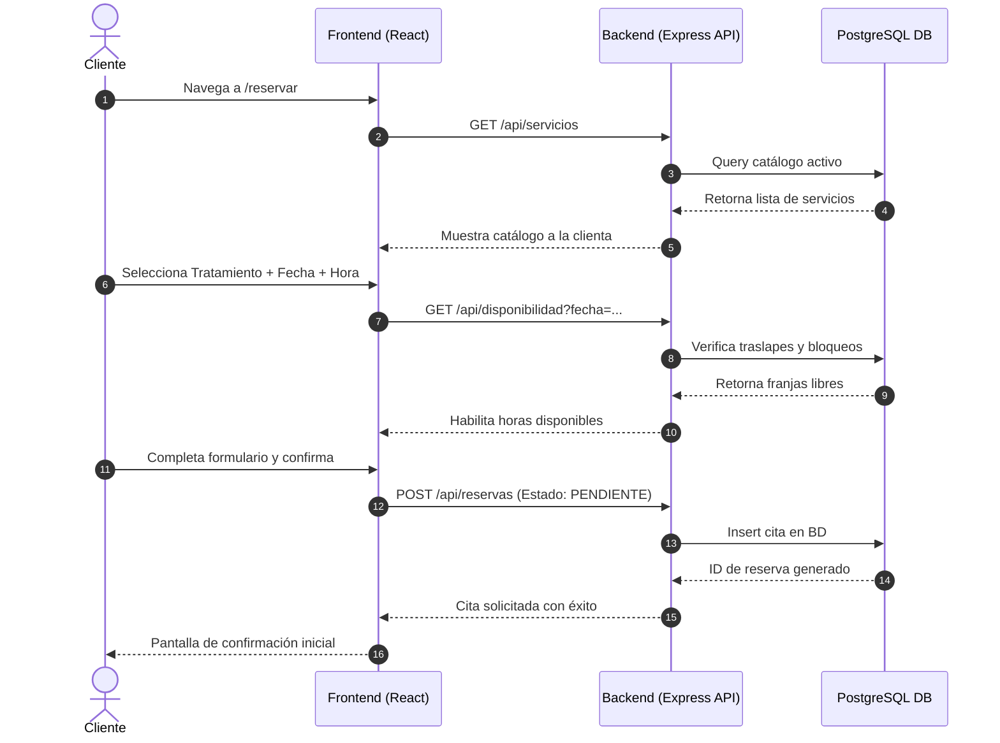
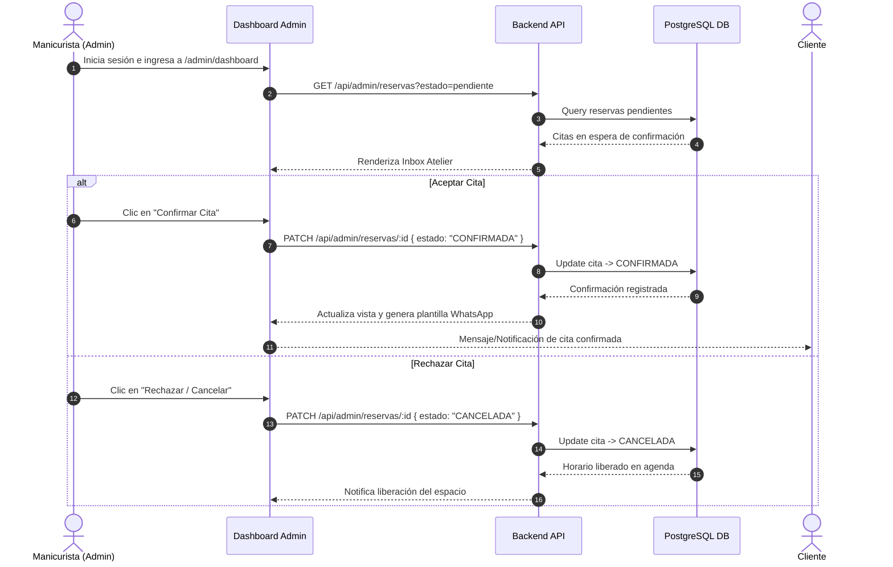

# 🔄 Documento 04: Flujos de Usuario y Ciclo de Vida de Reservas

## 🔄 Ciclo de Vida de una Cita (Estados)

Una reserva en **SECRET** pasa por diferentes estados desde su creación hasta su cierre:

```
           ┌──────────────┐
           │  PENDIENTE   │  (Solicitud realizada por la clienta)
           └──────┬───────┘
                  │
        ┌─────────┴─────────┐
        ▼                   ▼
┌──────────────┐    ┌──────────────┐
│  CONFIRMADA  │    │  CANCELADA   │
└──────┬───────┘    └──────────────┘
       │
       ▼
┌──────────────┐
│  COMPLETADA  │  (Servicio brindado e ingreso computado)
└──────────────┘
```

---

## 📅 1. Flujo de Solicitud de Reserva (Cliente)



---

## ⚡ 2. Flujo de Aprobación y Gestión (Admin / Manicurista)



---

## 🔒 3. Flujo de Bloqueo Manual de Agenda

Cuando la manicurista necesita tomar una pausa técnica, almuerzo o realizar mantenimiento de herramientas:

1. Ingresa a `/admin/calendario`.
2. Selecciona la opción **"Bloquear Turno"**.
3. Indica el motivo (*Almuerzo, Insumos, Personal*) y el rango de horas.
4. El sistema registra el bloqueo en la base de datos y deshabilita de inmediato esas horas en el portal público de reservas del cliente.
